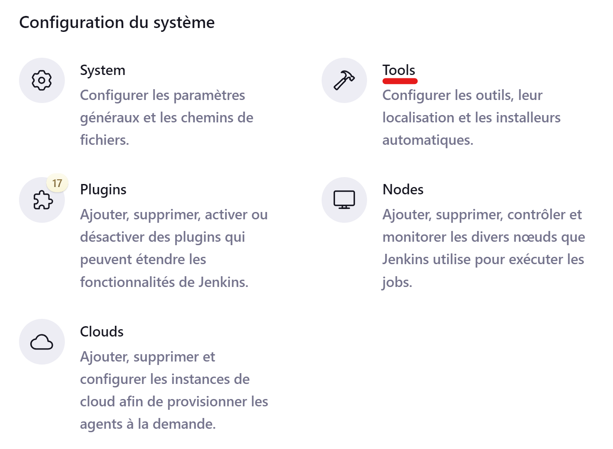

# DevOpsCD

The main purpose of the project is to experiment and visualize how to implement a Continuous Integration and Continuous Deployment system in a Devops environment.

## Getting Started

Building (if necessary) and running the container:
```bash
docker compose --project-name DevOpsCD up -d
```
To clean up:
```bash
docker compose --project-name DevOpsCD down --rmi all --volumes --remove-orphans
```

*\*Note: These commands are only help to see the project in a docker container but aren't useful for the project himself.*

## Steps for this project
- Fork the [repository](https://github.com/mohametdia/ST2DCE-PRJ.git) and clone it locally
- Adding this Readme.md file
- Change `MyController.java` to add our names

### Jenkins
- Start a Jenkins container in Docker desktop and open it in the browser
  
- Create a new pipeline job
  
  
  - Create `Jenkinsfile` in the root of the project
  - Configure the pipeline job, adding the `Jenkinsfile` to script section
    
    
  - Adding credentials
    
    
    
    
  - Adding tools
    
    
  - Adding Plugin `Docker`
    
    
  - Create a cloud docker
    
  - Add `0.0.1-SNAPSHOT` in the Dockerfile
  - Finally we can test and we obtain the following result
    
  - Adding Plugin `Kubernetes`
    
  - Create a cloud kubernetes
